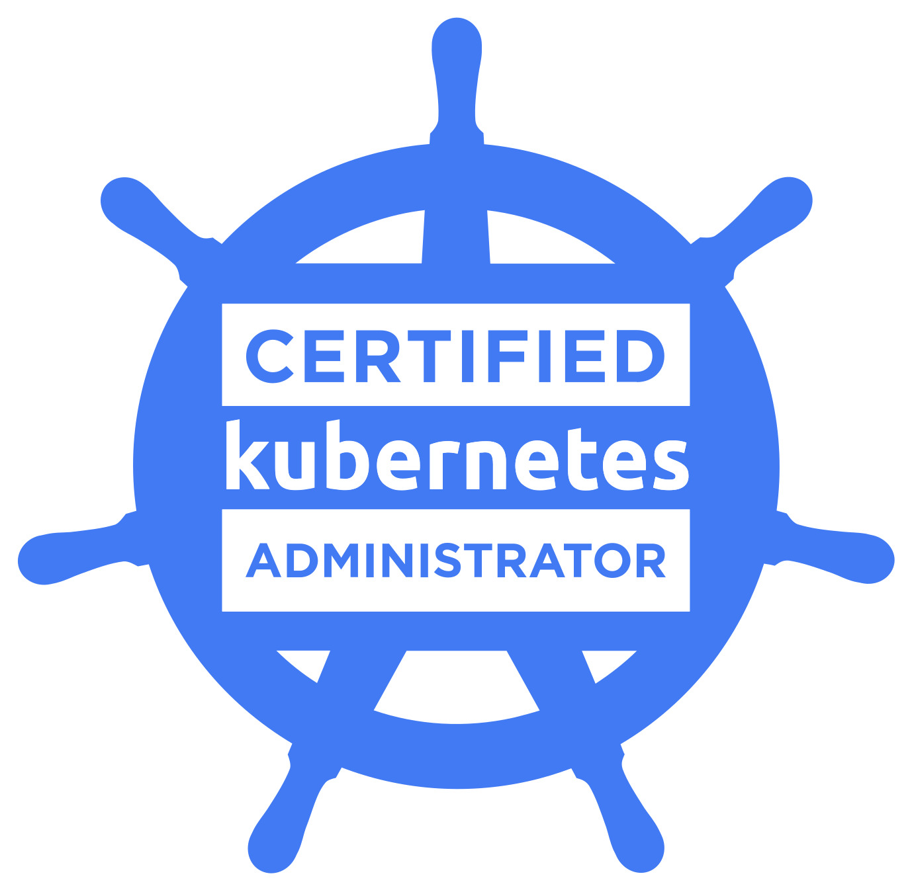

# CKA certificate badge and Verification Link: Karishma Singh

# k8s-Hands-on Practice
## About This Repository

This repository is created as a hands-on Kubernetes practice workspace aligned with the Certified Kubernetes Administrator (CKA) exam and real-world DevOps interview scenarios.

The goal is to:

- Strengthen Kubernetes fundamentals  
- Practice YAML writing from scratch
- Understand real production-like scenarios
- Demonstrate hands-on Kubernetes skills on GitHub

Skills Covered

- Kubernetes Core Objects (Pod, Deployment, Service)
- Configuration & Secrets
- Storage (Volumes, PVC)
- Networking & Services
- Resource Management
- Scheduling
- Troubleshooting & Debugging
- Imperative vs Declarative commands

Repository Structure

cka-kubernetes-practice/
- 📂 01-core-concepts/
- 📂 02-workloads/
- 📂 03-networking/
- 📂 04-configuration/
- 📂 05-storage/
- 📂 06-scheduling/
- 🔒 07-security/
- ⚠️ 08-troubleshooting/
- 💻 imperative-commands/
- 📄 README.md

Practice Environment
- Kubernetes Cluster: Kind 

📌 This repository is actively updated as part of continuous learning and interview preparation.
